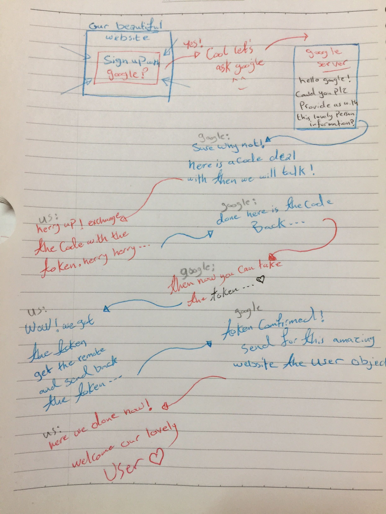

# Google Oauth Group :fire:

## Introduction :running:

In this lab we are going to integrate **OAuth** instead of managing usernames and passwords internally. And we did this with **GOOGLE** Oauth :tada:

So I'm going to introduce my lovely **group members**: 
1. our **BRAIN** Muhammed Tommalieh 🧠
2. our **VOICE** Hammad :loudspeaker:
3. our **DICTIONARY** Darah :books:
4. and ME Yasmin Adaileh..

First I'll going through the **process in general**, then Darah will tell us about how was the **Documentation**. After that Muhammed will **talk about the code** while Hammad will show us the **final result** as a users what we are going to see.
----------------------------------------

----------------------------------------

About the Documentation we are gitting it from here:
[Documentation]()
-----------------------------------------

Now the FUN part is with Muhammed ...
-----------------------------------------
Let's see the Final Result with Hammad ..
------------------------------------------- 
